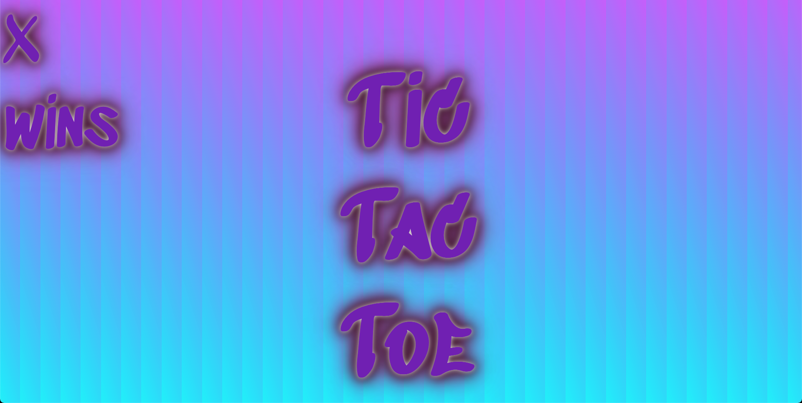

# Tic Tac Toe - Project0

A web-based interactive Tic Tac Toe experience.

## Project Description

The point of this project is to create and design the game Tic Tac Toe from the ver beginning using Javascript, HTML, CSS and jQuery. 
The game is to be accessible using a Web Browser.

## Technology used

##### Javascript
##### HTML
##### CSS
##### Styling samples from:
##### https://fonts.google.com/specimen/Sedgwick+Ave+Display
##### https://getcssscan.com/css-buttons-examples

## Game features

- The game Tic Tac Toe is functioning.
- X and O will be taken one after the other. 
- The game will stop being active to be played, and the winner will pop onto the screen to show which player wins.
- Retro flashes CSS features that will blow your mind. 
- By default X always starts.

## ___Unsuccessful___ game features

- Wasn't able ot assign either player to choose either X or O 
- Restart Button is not functioning 
- Score wasn't able to be kept

the approach taken, installation instructions, unsolved problems, etc.

# Big thanks to the Team Leaders, Tina, CJ & Mark for the help on this project! 

[1](images/1.png) [2](images/2.png) [3](images/3.png) 